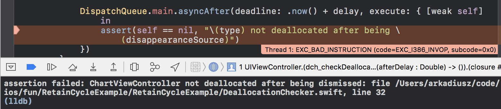

# DeallocationChecker

Learn about leaking view controllers without opening Instruments.

## Usage

First, import the library using `import DeallocationChecker`. Then call `dch_checkDeallocation()` from `viewDidDisappear(_:)` in your view controllers:
```swift
    override func viewDidDisappear(_ animated: Bool) {
        super.viewDidDisappear(animated)

        dch_checkDeallocation()
    }
```

If a view controller isn’t deallocated after disappearing for good, an assertion inside `dch_checkDeallocation(usingDelay:)` will fail:



At this point we can simply open the [Memory Graph Debugger](https://developer.apple.com/library/content/documentation/DeveloperTools/Conceptual/debugging_with_xcode/chapters/special_debugging_workflows.html#//apple_ref/doc/uid/TP40015022-CH9-DontLinkElementID_1) to investigate the reason of a cycle.

## Installation

### CocoaPods

Add the line `pod "DeallocationChecker"` to your `Podfile`

### Carthage
Add the line `github "fastred/DeallocationChecker"` to your `Cartfile`

## Author

Project created by [Arek Holko](http://holko.pl) ([@arekholko](https://twitter.com/arekholko) on Twitter).
